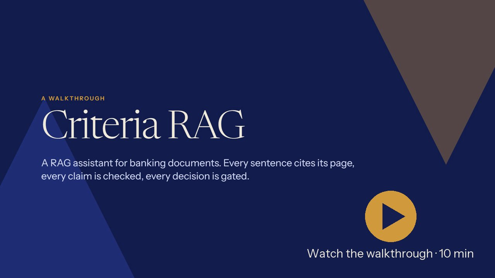
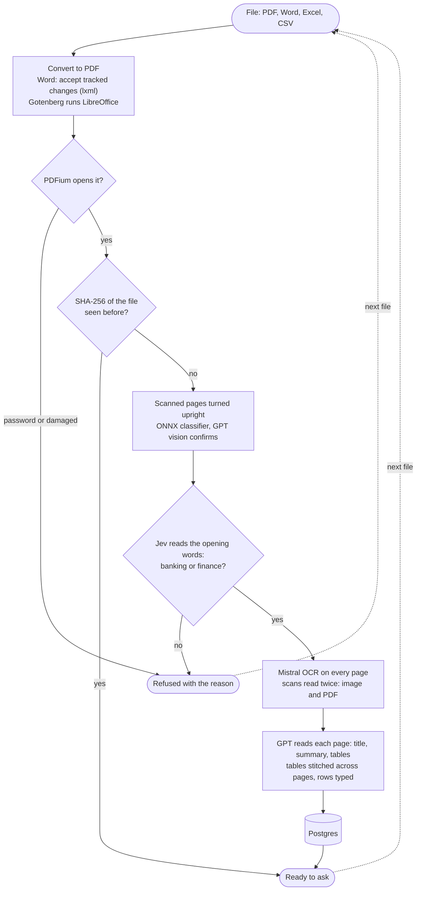
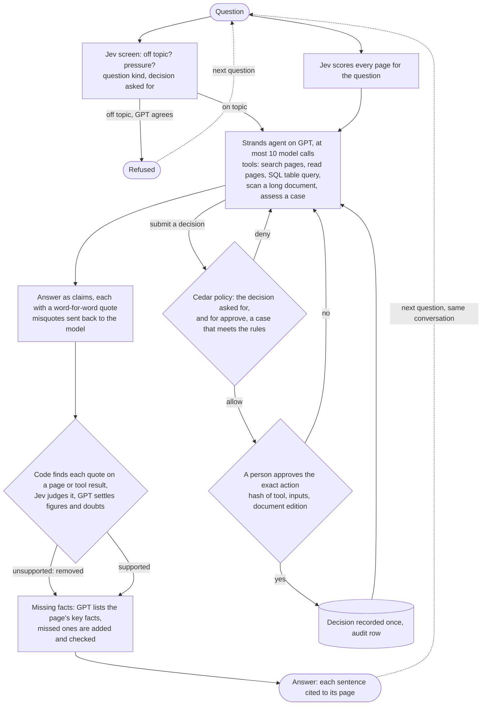

# Criteria RAG

Upload a banking document, such as a lender's criteria guide, a rate card or regulation, and ask it questions. Every sentence in an answer cites the page it rests on and is checked before you see it. Recording a lending decision needs a written policy to allow it and a person to approve it.

## Walkthrough

[](https://drruin.github.io/criteria-rag/)

A 10-minute video of the live app, the code and the design choices. Click the image to play it in the browser, with chapters. The narration is an AI clone of the author's voice.

| Time | Part |
|---|---|
| 0:00 | The problem and what runs where |
| 0:56 | Wrong files, the upload flow and scanned pages |
| 2:14 | Questions: streamed steps, citations, table answers and follow-ups |
| 3:31 | How each answer was made, and the code map |
| 3:45 | Jev and verification |
| 4:43 | Human approval and the Cedar policy |
| 5:34 | Attempts to skip the checks, and off-topic questions |
| 5:49 | Why Strands Agents |
| 6:11 | Langfuse traces and accuracy |
| 6:37 | How to run it |
| 7:09 | FAQ: 23 questions |

## Run it

Copy `criteria-agent/.env.example` to `criteria-agent/.env` and add your OpenAI, TypeSafe and Mistral keys. Then:

```sh
docker compose --env-file criteria-agent/.env up -d --build
```

Open http://localhost:8000. Langfuse traces are at http://localhost:8000/langfuse; the **How it works** button shows the sign-in.

## How it works

### Upload



Nothing is stored for a refused file. Table rows are stored once, so a table question is a SQL query, not a guess.

### Question



The conversation keeps every turn; when it nears the model's context limit, Strands summarizes the oldest turns. Quotes are checked against pages and tool results, never against the model's memory.

## Layout

```
criteria-agent/app/
  main.py      HTTP entrypoint
  core/        settings, storage, documents, prompts, schemas
  ai/          OpenAI and Jev clients
  ingest/      upload, OCR, tables
  answer/      agent, tools, claim checks, feedback
  gate/        decision policy (Cedar) and human approval
criteria-ui/   the web app
```

To run the agent or the web app without Docker, see `criteria-agent/README.md` and `criteria-ui/README.md`.

## Tests

With the stack running:

```sh
cd criteria-agent && uv run pytest
```
